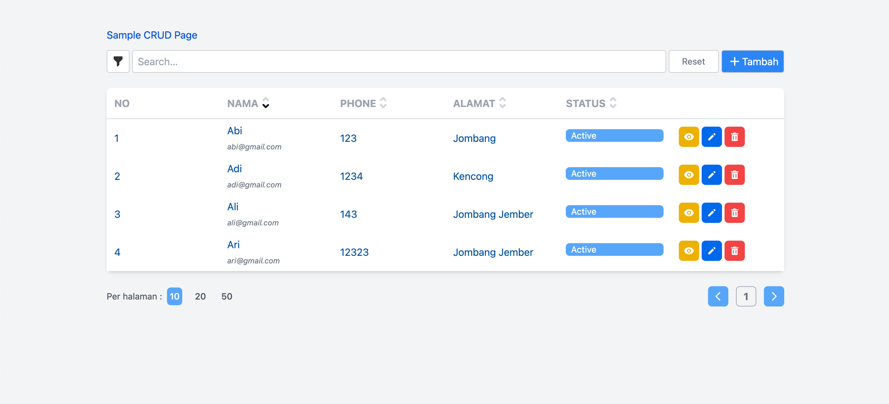
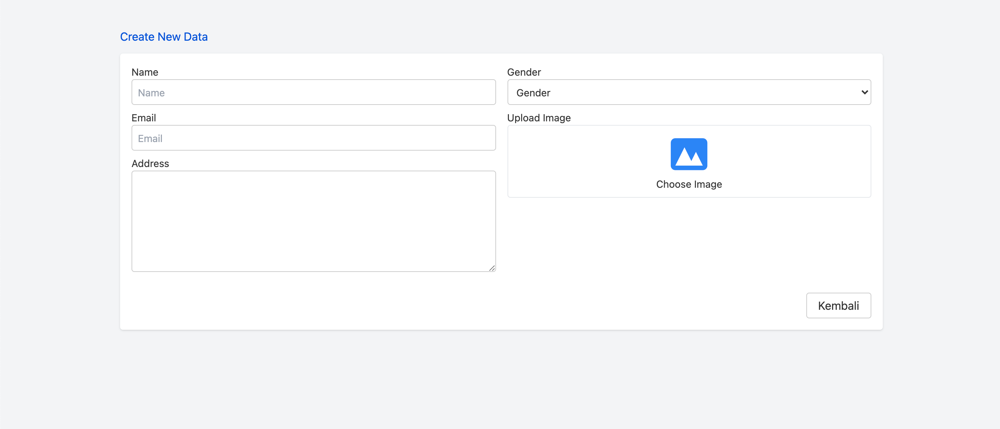
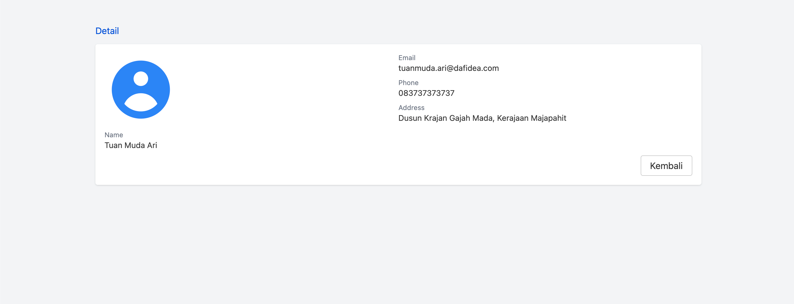

## Svelte + Tailwind
Simple CRUD Page

## Get started

Install the dependencies...

```bash
cd svelte-app
npm install
```

## Tailwind
```
npm install -D tailwindcss postcss autoprefixer
npx tailwindcss init -p
```
...then start [Rollup](https://rollupjs.org):

```bash
npm run dev
```

## Screenshots
|Page|Preview|
|----|----|
|Index Page     ||
|Create Page    ||
|Detail Page    ||